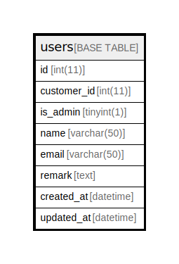

# users

## Description

ユーザー

<details>
<summary><strong>Table Definition</strong></summary>

```sql
CREATE TABLE `users` (
  `id` int(11) NOT NULL AUTO_INCREMENT,
  `customer_id` int(11) DEFAULT NULL COMMENT '顧客ID',
  `is_admin` tinyint(1) DEFAULT NULL COMMENT '管理者か',
  `name` varchar(50) COLLATE utf8mb4_unicode_ci NOT NULL COMMENT '名前',
  `email` varchar(50) COLLATE utf8mb4_unicode_ci NOT NULL COMMENT 'メールアドレス',
  `remark` text COLLATE utf8mb4_unicode_ci NOT NULL COMMENT '備考',
  `created_at` datetime NOT NULL COMMENT '作成日時',
  `updated_at` datetime NOT NULL COMMENT '更新日時',
  PRIMARY KEY (`id`)
) ENGINE=InnoDB DEFAULT CHARSET=utf8mb4 COLLATE=utf8mb4_unicode_ci COMMENT='ユーザー'
```

</details>

## Columns

| Name | Type | Default | Nullable | Extra Definition | Children | Parents | Comment |
| ---- | ---- | ------- | -------- | ---------------- | -------- | ------- | ------- |
| id | int(11) |  | false | auto_increment |  |  |  |
| customer_id | int(11) |  | true |  |  |  | 顧客ID |
| is_admin | tinyint(1) |  | true |  |  |  | 管理者か |
| name | varchar(50) |  | false |  |  |  | 名前 |
| email | varchar(50) |  | false |  |  |  | メールアドレス |
| remark | text |  | false |  |  |  | 備考 |
| created_at | datetime |  | false |  |  |  | 作成日時 |
| updated_at | datetime |  | false |  |  |  | 更新日時 |

## Constraints

| Name | Type | Definition |
| ---- | ---- | ---------- |
| PRIMARY | PRIMARY KEY | PRIMARY KEY (id) |

## Indexes

| Name | Definition |
| ---- | ---------- |
| PRIMARY | PRIMARY KEY (id) USING BTREE |

## Relations



---

> Generated by [tbls](https://github.com/k1LoW/tbls)
